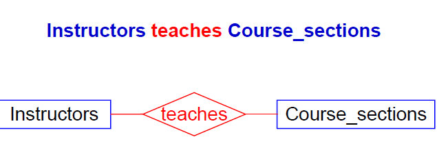

# database

[TOC]

## chapter1 Introduction

### terminology 专业术语

Database Management  System 数据库管理系统

Database 数据库

Intranet 内网


C/S架构 数据库和DBMS运行在数据库服务器中，数据库应用程序运行在客户机中，通过局域网实现数据访问

B/S架构 数据库和DBMS运行在数据库服务器中，数据库应用程序运行在应用服务器（web服务器） 用户客户端只需要安装浏览器，负责接收用户输入和结果展示

pseudocode 伪代码

prototype 原型

### Data Model

* Hierarchical Data Model 层次数据模型 

  a directed tree 有向树

  different kinds of records relate to one another in a hierarchical form

* Network Data Model 网状数据模型

    a directed graph without circuits

   a  generalization of the hierarchical model where a set of records in one layer might have two different containing hierarchies at the next layer up

* Relational Model 关系模型   (Object_Relational Model)

* Object-Orinted Model 面对对象模型 (Object_Relational Model)

### History of Database Systems

* Relational Model 关系模型

  our data will look like tables

* Relational Database

  all information is represented in the form of named tables with labeled columns

* Relational DBMS

**first normal form rule:** in the relational model, a column of a table must contain a single, unstructured value.

## chapter 2 The Relation Model

* Data Model 数据模型
  1. is a set of definitions describing how real-world data is conceptually represented as computerized information
  2. It also describes the types of operation available to access and update this information
* Relation Model
* Object-Relational Model

**Terminology**

* Table (relation) Old: file of records
* Column names(Attributes) Old: field names of records
* Rows(Tuples) Old: records of a file
* Table heading(Schema) Old: set of attributes

| 关系模型         | 关系数据库管理系统（SQL)   | 文件系统            |
| ------------ | ---------------- | --------------- |
| Relation 关系  | Table 表          | File of Records |
| Attribute 属性 | Column 列         | Field           |
| Tuple 元组     | Row 行            | Record          |
| Schema 模式    | Table Heading 表头 | Type of Record  |

**Definition**

- [database](#database)
  - [chapter1 Introduction](#chapter1-introduction)
    - [terminology 专业术语](#terminology-%E4%B8%93%E4%B8%9A%E6%9C%AF%E8%AF%AD)
    - [Data Model](#data-model)
    - [History of Database Systems](#history-of-database-systems)
  - [chapter 2 The Relation Model](#chapter-2-the-relation-model)
    - [2.3 Relational Rules](#23-relational-rules)
    - [keys Superkeys and NUll Values](#keys-superkeys-and-null-values)
      - [key & superkey](#key-superkey)
      - [table key](#table-key)
      - [Every table T has at least one key](#every-table-t-has-at-least-one-key)
      - [Null Values](#null-values)

**Note**

* the number of rows changes frequentlty and rows are not remembered by users
* the columns usually DON'T change in number, many names are remembered, and USED TO POSE QUERIES

**Program-Data Independece** 数据独立性

when asked to make up a query to answer a question, query must still answer the question even if all the data changes.


Column type(Domain, Datatype) : A table is DECLARED in SQL. Columns have certain TYPES as in SQL : integer, char,date..


Problems of Column type(cont.)

1. **Integrity 完整性** Most commercial database systems don't support types consisting of enumerated(枚举) sets
2. **particular type ** 可以创建一个自定义类型 Domain vs Domain


**Relational Algebra 关系代数**

Domain of column is like an enumerated type

Domain(City) All the city names in the U.S.


**Cartesian Product**笛卡尔乘积

set： CID = Domain(cid) CNAME = Domain(cname) 

then consider cid * cname consisting of all tuples (x,y) x in cid y in cname

A relation between these four domains is a subset of the Cartesian products Í

A \subset cid x cname

### 2.3 Relational Rules

* Rule 1. First Normal Form Rule 第一范式  **Can't have multi-valued attributes(repeating fields.) or have any internal structure(record).**

1. could create one table with duplicates on different rows but this is bad for other reasons 不知道有多少列 各个元组所需要的列数不同，会造成空间浪费
2. ends up meaning we have to create two tables and join them in later queries.
3. in OR model, it's OK, but won't handle this for a while so as not to confuse you. assume relational no multi-valued fields

* Rule 2. **Access Rows By Content Only Rule**只能根据内容访问（取某一元组）
  1. can't say the third row down from the top. no order to the rows and the columns
  2. disallows pointers to rows e.g. row IDs or "refs" 
  3. Most relational products break this rule by allowing users to get at rows by RIDs
  4. new object-relational products have refs as part of syntax

  **implies**:
  1. no order to rows and columns
* Rule 3. The Unique Row Rule 元组的唯一性
  1. two rows can't be same in all attributes at once. So that a relation is an unordered SET of tuples
  2. but many products allow this for efficiency
  3. **we will assume that all these rules hold perfectly**
### keys Superkeys and NUll Values
* **idea of keys**: some set of columns in a table distinguishes rows
* defined by DBA which set of column has this property
* It is USEFUL to have such a key for a table. other table can refer to a row in this table
#### key & superkey
superkey : a set of columns that has uniqueness property 
e.g. id,name. only id matters
key : is a minimal superkey: no subset of columns also has uniqueness.e.g. id
#### table key
Given a table T, with Head(T) = {$A_1,A_2,A_3....A_n$} A key for table T, sometimes called a candidate key, is a set of attributes. K = {$A_{i1},....A_{ik}$},,with two properties:
#### Every table T has at least one key

#### Null Values
Null unknown
* A null value is placed in a field of a table when a specific value is either unknown or inappropriate
* a null value can be used for either a numeric or character type.BUT IT HAS a different VALUE FROM ANY REAL FIELD. It's not zero or null string
* be handled specially by commercial databases

**RULE 3 Entity Integrity Rule**实体完整性
No Column belonging to a primary key of a table T is allowed to take on NULL values for any row in T

与Rule 3 等价

### 2.5 Relational Algebra

abstract language 

information stored in the form of tables $\implies$ results of a query in table form

two types of operations:

* set-theoretic operations. depend on fact that table is a set of rows

* native relational operations. depend on structure of table

  | NAME          | SYMBOL | FORM      | EXAMPLE |
  | ------------- | :----: | --------- | ------- |
  | UNION(并)      |   ∪    | UNION     | R U S   |
  | INTERSECTION交 |   ∩    | INTERSECT | R ∩ S   |
  | DIFFERENCE 差  |   -    | MINUS     | R - S   |
  | PRODUCT 乘积    |   ×    | TIMES     | R × S   |

native relational operations

| NAME             | SYMBOL             | FORM                    | EXAMPLE                                           |
| ---------------- | ------------------ | ----------------------- | ------------------------------------------------- |
| PROJECT(投影)    | R[] $\pi$          | R[]                     | R[$A_{i1},...,A_{Aik}$]<br>$\pi_{Ai1,....Aik}(R)$ |
| SELECT(选择)     | R where C $\delta$ | R where C $\delta_c(R)$ | R where $A_1 = 5$ $\delta_{A1}(R)$                |
| JOIN（连接）     |                    | JOIN                    |                                                   |
| DIVISION（除法） | ÷                  | DIVIDEBY                | R ÷ S                                             |


#### Compatible Tables

* Table R and S are *compatible* if they have the same headings
* if Head(R) = Head(S) , with attributes chosen from the same domains and with the same meaning


**In relational algebra, two columns are said to have the same meanings if they have the same name of column**


only in two *compatible* tables, set-theoretic operations make sense.

### 2.6

Def 2.6.3 Assignment, Alias**

Table R: R(A1,A2...,An)

赋值运算 S(B1,B2,..,Bn) = R(A1,A2,...,An)

define a new table S, and Domain(Bi) = Domain(Ai) for all i (1 <= i <= n)

可以利用赋值运算创建临时的中间关系

* 可以利用已有的关系创建中间关系
* 可以用一个关系代数表达式的计算结果创建中间关系
* 中间关系有关系名 并且可以定义新的属性名和调整属性的排列次序


**def 2.6.4 Rroduct  x**

the product of the tables R and S is a table T that 

* if $Head(R) = {{A_1,A_2,.....,A_n}}$, $Head (S) = {B_1,B_2,....,B_n}$ then Head(T) = {$R.A_1,....R.A_n,S.B_1,......,S.B_m$}
* t is a row in T if and only if there are two rows u in R and v in S such that t(R.$A_i$) = u(Ai) for i <= i <= n and t(S.Bk) = v(Bk) for 1<=k<= m 

the number of columns in product of tables R and S is ($C_R+C_S$)

the number of rows in product of tables R and S is ($N_R × N_S$)

### 2.7 Native Relational Operations

#### 2.7.1 projection 映射 R[$A_{i1},......A_{Ik}$]

$Head(R) = \{A_1,A_2,...,An\} $

$A_{ij} \in Head(R) \space for\space all \space 1 \le j \le k$

 the projection of R on attributes Ai1,Ai2,....Aik,is a table T that Head(T) = {Ai1,....,Aik}

can be write as $\pi_{Ai1,.....Aik}(R)$

*cast out duplicate rows in the result of projection*

#### 2.7.2 Selection

S where C or $\delta_C(S)$

the rows of S that obey the selection condition C


The selection Condition C

C can be any comparison of the form $A_i \space \theta  \space Aj $ or $A_i \theta a$

Ai are attributes of S having the same domain, a is a constant from Domain(A_i) and $\theta$ is  one of the comparison operators <,>,=,>=,<=,<>

C and D are conditions.  new conditions can be writing C AND D, C OR D, NOT C

#### 2.7.3 precedence of relational operation

| Precedence | Operations       |
| ---------- | ---------------- |
| Highest    | PROJECT          |
|            | SELECT           |
|            | PRODUCT          |
|            | JOIN,DIVIEDBY    |
|            | INTERSECTION     |
|            | UNION,DIFFERENCE |
|            |                  |
| Lowest     |                  |

#chapter 3 SQL

SQL Structured Query Language

语言基本成分

* 符号 26个英文字母，括号，阿拉伯数字，四则运算
* 保留字 
  * 标识语句类型 CREATE, SELECT,INSERT,ALTER
  * 标识对象类型 TABLE,VIEW,PROCEDURE,TRIGGER
  * 标识语句成分 unique,primary key,with check option
  * 数据类型，内置函数
  * 可编程SQL中的流程控制命令，if then else. while... for....
* 标识符
* 常量


基本标识规范

* 完整的SQL语句 以命令动词开始， 以分号;作为结束符
  * 可以一次只执行一条，也可以一次执行多条（批处理）
  * 批处理下，分号既可以作为前一条语句的结束符，也可以看做不同SQL语句间的分隔符
* 除常量外，SQL语言中的其他成分仅支持西文字符，且字母不区分大小写
  * 保留字、表名、列名都不区分大小写
* 字符或日期、时间类型的常量通常使用单引号定界符，可支持不同的日期显示格式


ANSI SQL Datatype

* CHARACTER DataType
* NUMERIC DataType
* DATA/TIME DataType

| name                 | comments                         |
| -------------------- | -------------------------------- |
| CHARACTER(n)         | fixed-lenth character strings    |
| CHAR(n)              |                                  |
| CHARACTER VARYING(n) | variable-length character things |
| CHAR VARYING(n)      |                                  |

| name     | comments                                                  |
| -------- | --------------------------------------------------------- |
| INTEGER  | represents an integer. minimum and maximum depends on DBA |
| SMALLINT |                                                           |
| BIGINT   |                                                           |

| name             | comments                                                     |
| ---------------- | ------------------------------------------------------------ |
| DECIMAL(p,s)     | Exact numerical, precision p, scale s.<br>precision: total number of  digits<br>scale: number of digitsto the right of the decimal point |
| NUMERIC(p,s)     |                                                              |
| float            |                                                              |
| real             |                                                              |
| double precision |                                                              |


Oracle: 

| name       | comments                                                   |
| ---------- | ---------------------------------------------------------- |
| CHAR(n)    |                                                            |
| VARCHAR(n) |                                                            |
| LONG       | variable-length character data(text data maximum-size 2GB) |
|            |                                                            |

SQL Structured Query Language

SQL statement for data manipulation

* SELECT
* INSERT
* DELETE
* UPDATE


contents

SELECT


SELECT ... FROM ...	[WHERE .....]

[GRPUP BY...[HAVING ....]] \[ORDER BY]


* ALL | DISTINCT
  * select distinct pid from orders 返回不重复的pid
  * select all pid from orders返回值可能重复


table and column alias

* table_name as alias_name
* table_name alias_name

SELECT DISTINCT CNAME,ANAE FROM CUSTOMERS C,ORDERS O ,AGENTS A

WHERE C.CID = O.CID


* column alias in select clause

  SELECT ordno, dollars, o.qty * p.price * (1-c.discnt*0.01) as my dollars

  FROM customers c,orders o ,products p

  where c.cid = o.cid and o.pid = p.pid


SELECT c1.cid c2.cid

FROM customers c1, customers c2

where c1.city = c2.city and c1.cid <c2.cid


* select [distinct] column name list | expressions | *
  * 目标子句
  * 单个属性的投影、一个表达式的计算结果
  * \* 表示所有属性
  * distinct可以进行唯一性检查
* from table-list
  * 范围子句 定义可以访问的关系表
  * 可以定义别名
  * 别名不能重名
  * 同名的属性通过表名.属性名确定列否则可以直接通过属性名


##subquery

子查询有关的谓词(predicate)

* in
* some
* any
* all
* exist
* is null
* between
* like column [not] like val1 [escape val2] 
  * underscore_ 单个字符 
  * percent % any sequence of zero or more characters


* uncorrelated subquery
  * subquery is completely independent of outer one
* correlated subquery
  * subquery use data from an outer select phrase
* scoping rule
  * variables from outer selects can be used in inner subqueries,but reverse is not true


expr $\theta$ SOME|ANY (subquery)

if and only if. at least one element is returned by subquery, expression is true


expr $\theta$ ALL(subquery) expression is true for every one of the elements


the like predicate

colname [not] like val1 [escape val2转义指示符]

 underscore. _ single character

percent % any sequence

escape character: precedes quoted literal character


## Union Operator and For All Conditions

* the union operator并
  * subquery union subquery
    * NO duplicate rows
  * subquery union all subquery
    * may have duplicate subquery

集合运算

union

intersect

except

minus

必须是相容的compatible

intersect and except / minus 不是必须的 以及 结果列中必须含有关键字，否则可能会出现错误


* 对表进行重命名时，可以重新定义表中属性的属性名

* 可以在from子句中嵌入一个subquery 不是必须的 可以通过定义视图view实现

  ```sql
  select c.cid, c.cname
  from customers c, (select avg(discnt) as avg_dis form custerms) as w 
  where c.discnt > w.avg_dis
  ```


| name  | argument type   | result type | description    |
| ----- | --------------- | ----------- | -------------- |
| count | any             |             | counts of rows |
| sum   |                 |             |                |
| avg   |                 |             |                |
| max   | char or numeric | same as arg |                |
| min   | char or numeric | same as arg |                |

可以在select和 having中使用统计函数

* select + 统计函数
* select 分组属性+ 统计函数 group by 分组
* select group by 分组属性 + having 组选择条件


先执行查询得到满足条件的结果元组集合S,再根据select子句中的要求进行统计计算，输出统计结果


### handing null values

* a null value is not equal to any values(including a null value)
* set functions must also ignore null values(including the count function)
  * Note Count不存在空值问题
* the value returned by a set function acting an empty set of values is
  * count(...) return 0
  * others return null value


select count(distinct city) from customers 非空且互不相同的city的值

select count(city) from customers 非空的city值

select count(*) from customers 元组的个数


group by clause & having clause

带group by子句的查询被称为分组统计查询，group By称为分组属性

还可以再有having 子句 


在分组选择查询中，查询结果可以没有统计值

# chapter 4 Object-Relational SQL(Oracle)

ORDB: 提供元组、数组、集合一类丰富的数据类型以及除了新的数据类型的操作 有继承性和对象标识等特点


数据类型定义：

* 基本类型
* 复合类型
  * 结构类型
  * 数组类型
  * 集合类型

## 4.1 Object Type

composite structured type

定义新的数据类型

```sql
create type typename as OBJECT(attrname datatype,...);
DROP TYPE typename;
```

一经定义就以持久形式保存在数据库中，可以使用像内置的数据类型一样使用这些复杂的数据类型，以扩充系统的数据类型

example

```mysql
create type name_t as object(Iname varchar(30)
                            fname varchar(30)
                            mi char(1));
create type doc as object(
name varchar(30)
author varchar(30)
data Date);           
create table customers(
cid char(4) not null,
primary key(cid)
);
                            
```

对象类型的使用

* 使用所创建的对象类型来创建新类型
* 使用所创建的对象类型来创建新的表
* 使用对象数据类型来直接创建一张表
  * 表结构与对象类型结构相同
  * 在创建的表中增加完整性约束

```mysql
create type person_t as object(
	ssno int,
    pname name_t,
    age int
);
create table teachers(
	tid int,
    tname name_t,
    room int
);
create table tablename of typename{(constraint-define)}
create table people of person_t(
	primary key(ssno)
);
```

### 对象值的创建、查询 更新

创建：构造函数

对象构造函数

typename(argument,....) 

`name_t('Einstein,'Albert','E')`

返回对象取值的函数

value(...)

查询 通过类型的值

```mysql
create table teachers(
	tid int,
	tname name_t,
	room int);
select t.tid,t.tname,t.fname form teachers t
where t.room = 123

```

对象值的更新

* 修改整个对象值
  * 表中的一个属性的值域是对象类型时，可以用‘对象’值直接对该属性进行赋值
  * 一张表基于对象类型创建 那么对象值可以直接修改整个元组
* 可以修改对象中成员属性的值


对象的引用类型

* 引用类型 ref < object type >
  * 指向某个元组对象的指针类型
  * 用于实现对象类型之间的嵌套引用
* 在使用含有ref类型的对象类型(Object Type)来创建表时，必须使用Scope for子句来限制 REF 属性的取值范围


#### 定义类型直接的引用关系

* 定义方法
  * 先定义一个对象类型 X
  * 然后再定义一个对象属性 Y，在类型Y中含有对类型 X的引用属性（REF）属性，从而构成了类型X与类型Y之间的引用关系
* X 被称为基本对象类型 （被引用类型）
* Y 称为引用类型

```mysql
create type customer_t as object(
	cid char(4)
    cname varchar(13)
    city varchar(20)
    discnt real
)
create type order_t as object(
	ordno int,
    month char（3）
    ordcust ref customer_t
)
```

#### 创建含有引用类型的关系表

* 基本方法
  * 先使用基本对象类型创建响应 的 基本关系表
  * 再使用含有ref属性的引用类型创建对应的关系表

```sql
create table customers of customer_t(primary key(cid))
create table orders of order_t(
	primary key(ordno),
	scope for（ordcust) is customers
```

scope for子句限制ref的取值范围 在某个table内

#### 引用关系查询

根据元组ref引用关系进行查询

```sql
select o.ordno o.ordcust.cname
form orders o 
where o.dollars > 200.0
```

#### 引用关系查询

```sql
select distinct x1.pid 
form oders x1 , orders x2
where x1.pid = x2.pid and x1.ordcust< x2.ordcust
等价 ordcust 承担起 cid的责任
select distinct x1.pid
form orders x1,orders x2
where x1.pid= x2.pid and x1.cid < x2.pid
```


#### 函数与谓词

* 两个函数
  * 获取对象（元组）的引用指针：REF（。。。）
  * 返回引用指针所指向对象的值：DEREF(....)
* 两个谓词
  * is dangling
  * is NULL
* IS DANGLING 
  * 用于判断所引用的原组是否存在
  * 不存在返回TRUE,否则返回FALSE
  * 主要用于检测那些错误的对象引用指针
* IS NULL
  * 也可以使用 is null来查找取值为null的ref属性
  * 但是is dangling 不等于 is null
* A dangling ref is non-null but useless
* if o.ordcust is null or dangling , then o.ordcust.cname is null

#### 类型的循环嵌套定义

obeject type不能嵌套定义，但是ref关系可以实现嵌套引用

```sql
create type police_officer_t as object(
	pol_person person_t,
    badge_number integer,
    partner ref police_officer_t
)
create table police_officers of police (
	primary key(badge_number),
    scope for (partner) is police_officers
)


```


#### 其他约束

有关ref定义的其他约束（REF Dependencies)

1. 两张表之间的相互REF关系的定义

   1. 首先，定义两个具有相互ref关系的对象
      1. 部分创建（partially create)第一个对象类型（只给出类型名，没有类型的详细定义）
      2. 详细定义第二个对象类型（包含对第一个类型的引用属性）
      3. 再详细定义第一个对象类型
   2. 再用创建好的对象类型创建关系表

2. 两个具有相关REF关系的表/类型的删除

   1. 删除类型drop type之前需要先删除表 drop table

   2. 删除类型 drop type 时需要采用强制删除方式

      `drop type typename force`

3. REF属性数据的加载

   1. 方法一 先不管ref属性的赋值，再使用update操作修改ref属性的取值
   2. 使用带有子查询的插入操作

```sql
update orders o
set ordcust = (select ref(c) from customers c where c.cid = o.cid)

insert into police_officers
select value(p),1000,ref(p0)
from people p, police_officers p0
where p.ssno = 1234 and p0.badge_number = 99
```

### collection Type

collection type allow us to put multiple values(collections of values ) in a column of an individual row

* table type(nested table)
* array types
  * containing items all of the same type **element type**


```sql
create type dependents_t as table of person_t
create table employees(
	eid int,
    eperson person_t,
    dependents denpendents_t
    primary key(eid)
)
nested table dependents store as dependents_tab
```

创建两个关系表

* employee 职工记录
* dependents_tab 家属信息 嵌套表


nested table 访问

```sql
select dependents
from employees
where eid = 101

select eid
from employees e
where 6 <(select counts(*) from table(e.denpendents))
```


* Oracle 数据库没有提供nested table的相等比较运算
  * 可以使用IN操作符来实现某些需要通过nested table进行的查询功能

不支持对嵌套属性的统计查询功能


Array Types for varrays

```sql
create type extensions_t as varray(4) of int

```

|          | nested table | varray         |
| -------- | ------------ | -------------- |
| 排列次序 | 无序         | 有序           |
| 最大数目 | 没有限制     | 确定的值       |
| 存储组织 | 单独的存储表 | 直接存储在表中 |


nested table与 varray

可以通过嵌套表属性执行insert操作，或通过update操作修改其成员的取值


但是varray不能插入或修改，只能通过update语句修改整个varray的取值


Embedded SQL 嵌入式数据库

SQL statements embedded in host language

```c
exec sql 
	select count(*) into :host_var
	from customers

```

* host variable(program variable) prefix(colon : ) of variable shows DBMS this is a program variable
* host variable can be used to
  * 接收DBMS产生的 值
  * 存取hostlanguage产生的值

  ​

# chapter 6 Database Design

*  database design ： the process of producing a detailed data model of database
* logical data model . logical and physical design choices and physical storage parameters needed to generate a design in a **data definition* language**
* ​


​	关系数据模型

* Entity-Relationship(ER) model: an abstract way to describe a database
* design approach, entity-relationship modelling, is more intuitive, less mechanical, but basically leads to the same end design


* ER Model
  * three fundamental data classification objects
    * entity
    * attribute
    * relationship
* the contents of this section
  * entities, attributes, and sample ER Diagrams
  * Transforming Entities and Attributes to Relations
  * Relationships among Entites


* Entity
  * a collection of distinguishable real-world objects with common properties
  * an entity instance is a real-world object
    * physical object
    * an event
    * a concept
* An entity such is mapped to a relationship table
  * represents a set of  objects
* each row is an entity occurrence, or entity instance
  * represents a particular object


* Attribute 
  * an attribute is a data item that describes a property of an entity or a relationship


special terminology for special kinds of attributes

* identifier,  id

* descriptor

* single-valued

* composite_ attribute

* multi-valued attribute

  ​

identifier(candidate key)

* an identifier is an attribute or set of attribues that uniquely identifies an entity instance
* there might be more than one identifier for a given entity

primary identifier(主键)

*  a single key identified by DBA

descriptor

* a descriptor is a non-key attribute,descriptive

composite attribute

* a group of simple attributes that together describe a property

multi-valued attribute 

* can take on multiple values for a single entity instance


Transforming Entities and Attributes to Relations

* An entity is mapped to a single table
* a multi-valued attribute must be mapped to its own table


relationships among entities

* a relationship R defines a rule of correspondence between the instances of these entities
* degree of relationship
  * the number of entities m in the defining list
* binary relationship
  * between two entities
* ring or recursive relationship
  * a binary relationship between an entity and itself 
* N-ary


联系 relationship用菱形符号表示




**Cardinality of Entity Participation in a relationship**

* Entities E and F, relationship R
  * dots are instances
  * lines are relationship instances
  * ​

if max-card(X,R)=1 X is said to have single-valued participation单值参与

if max-card(X,R) = N, x is said to have multi-valued particifation


is min-car(X,R) = 1 **mandatory participation**强制参与

min-card(X,R) = 0, optional participation 可选参与


one-to-one

both entities are single-valued in the relationship(max-card concept  only)

many-to-one

one entity is multi-valued and one is single valued

many-to-many

both entities are multi-valued 

**N-N relationships**

* when two entities E and F take part in many-to-many binary relatinship R, the relationship is mapped to a representative table T in the related relational database design


the table T contains columns for all attributes in the primary keys of both tables transformed from entities E and F

* this set of column forms the primary key for the table T

T also contains columns for all attributes attached to the relationship


**N-1 Relationships**

represent with foreign key in entity with single valued participation(the many side)

since max-card(F,R)=1,each row of T is related by a foreign key value to at most one instance of the entity E


Optional on one side

* represent as two tables, foreign key column in one with mandatory participation: column defined to be NOT NULL

Mandatory on both sides

* never can break apart. it's appropriate to think of this as two entities in a single table


cardinality 基数


weak entities

* a weak entity is an entity whose occurences are dependent for their existence, through a relationship R, on the occurence of another(strong entity)
* ​