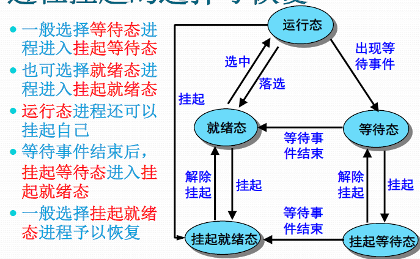
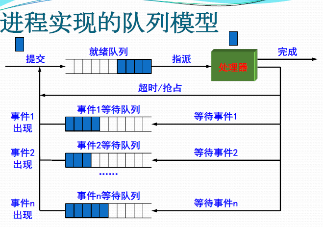
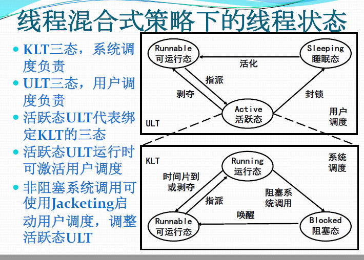
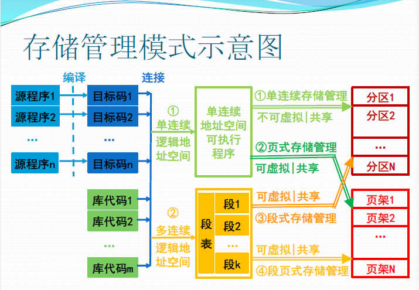
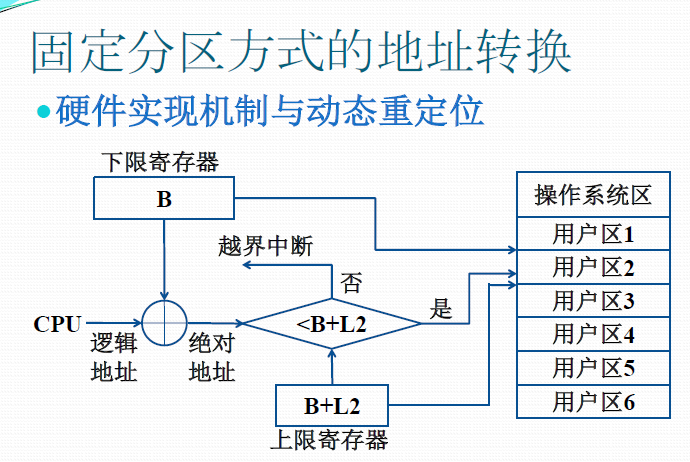

# 操作系统 OS

[TOC]

葛季栋 gjd@nju.edu.cn   gjdnju@163.com 费楼924室

## 教师信息

### 研究兴趣

* 过程挖掘、过程建模、工作流   BPM&NLP
* 云计算环境工作流调度 移动云计算 移动边缘计算
* 文本挖掘  法条推荐 & 文书相似度量

资源的调度和分配

## 基本问题

如何使用和操作计算环境，如何利用计算资源

只要有计算就有操作系统

形而上学谓之道，形而下学谓之器

计算技术 管理学 运筹学

最基本的抽象

*  进程抽象 对已进入主存正在运行的程序在处理器上操作的状态集的抽象。
* 虚存抽象 对物理主存的抽象，进程可以获得一个硕大的连续地址空间来存放可执行程序和数据，可使用虚拟地址来引用物理主存单元
* 文件抽象 对设备（磁盘）的抽象

# chapter1

##1.1

电子数字计算机 按照已设定的程序进行数据处理的电子设备

1946年 ENIAC

## 1.2 

中央处理器 主存 外设 总线

外设： 输入 输出 存储设备 网络通信设备

存储程序计算机 冯诺依曼计算机模型

总线 Bus 内部总线 系统总线 通信总线

CPU 原运算核心 Core 控制单元 Control Unit

存储器的层次结构 容量更小 速度更快 价格更高

设备控制方式： 

* 轮询方式 CPU忙式控制 数据交换
* 中断方式 CPU 启动/中断 数据交换
* DMA 方式 CPU 启动/中断 ， DMA数据交换Direct Memory Access 直接存储器存取,是一种快速传送数据的机制

## 1.5 操作系统

OS opreating system

管理软硬件资源、控制程序执行，改善人机界面，合理组织计算机工作流程，为用户使用计算机提供良好运行环境。

组成：

* 进程调度子系统

* 进程通信子系统

* 内存管理子系统

* 设备管理子系统

* 文件管理子系统

* 网络通信子系统

* 作业控制子系统

  ​

  ​

处理器资源 内存资源 设备管理 信息资源管理 信息量资源（如何管理进程之间的通信）

屏蔽资源使用的底层细节：

向其他部分提供一个抽象、通用的接口

资源共享方式

* 独占使用方式
* 并发使用方式

资源分配策略

* 动态分配方式
* 静态分配方式
* 资源抢占方式

## 1.7 多程序同时计算

CPU速度与I/O速度不匹配的矛盾 

只有多程序同时进入内存争抢CPU运行，才可以使得CPU和外围设备充分并行，从而提高计算机系统的使用效率

feature:

1. CPU与外部设备充分并行
2. 外部设备之间充分并行
3. 发挥CPU的使用效率
4. 提高单位时间的算题量

实现：

为进入内存执行的程序建立管理实体：进程

OS应该能管理与控制进程程序的执行

OS协调管理各类资源在进程间的使用

**Pointers**

* 如何使用资源 调用操作系统提供的服务历程 （如何陷入操作系统）
* 如何复用CPU 调度程序 （在CPU空闲时让其他程序运行）
* 如何使CPU与I/O设备充分并行 设备控制器与通道（专门的I/O处理器）
* 如何让正在运行的程序让出CPU 中断 （中断正在执行的程序，引入OS处理）

操作系统的程序接口：

* 系统调用 为所有运行程序提供访问操作系统的接口

系统调用的实现机制：

* 陷入处理机制。 控制和实现系统调用的机制
* 陷入指令。
* 系统调用都事先规定了编号

入口地址表

#chapter 2

程序以进程的形式来占用处理器和系统资源

##2.1处理器状态

### 2.1.1 处理器

1. 指令系统和寄存器

取指令 译码 执行

计算机的指令集合称为指令系统

分为数据处理、转移、传送、移位、字符串及I/O等六大类

2. 特权指令 非特权指令

特权指令是指仅在内喝下才能使用的指令

非特权指令是指在目态和管态都能工作

3. 内核态和用户态
4. 状态及转换

用户态向内核态

* 程序请求操作系统服务，执行系统调用
* 在程序运行时产生中断事件，运行程序被中断，转向中断处理程序处理
* 在程序运行时产生异常事件，运行程序被打断，转向异常处理程序

内核态向用户态

* 加载陈旭状态字的特权指令 实现内核态返回用户态 将控制权转交给应用进程

### 2.1.2 程序状态字

Program Status Word,PSW 程序状态字 存放在一组特殊的寄存器里

状态标志

控制标志

系统标志

PSW是用来指示运行程序状态，控制指令执行顺序，并且保留和指示与运行程序有关的各种信息，主要作用是实现程序状态的保护和恢复。

特权指令 只有操作系统程序才能调用 可能会威胁到系统安全性

处理器模式

计算机通过设置处理器模式实现特权指令管理

一般设置 0,1,2,3等四种模式

中断： 程序执行中，遇到急需处理的事情，暂时终止当前程序。执行相应事件。

**中断是激活操作系统的唯一方式** 广义的中断，包括中断和异常

中断源

* 处理器硬件故障中断事件。 保护现场，停止设备，等待人工干预
* 执行机器指令引起
  * 算术异常。（除数为0）等 简单处理，报告用户
  * 非法指令，用户态使用特权指令，地址越界等 终止
  * 终止进程指令
  * 虚拟地址异常。调整内存后重新执行
* 自愿性中断。请求OS服务，又称系统调用。请求分配外设，OS等 
* i/o中断
* 外部中断

中断系统。响应和处理中断的系统，包括硬件子系统和软件子系统

响应由硬件子系统完成，处理由软件子系统完成

指令执行周期最后增加一个微操作，以响应中断，检查中断。

发现并响应中断/异常的硬件装置称为中断装置。

中断控制器‘：

cpu一个控制部件，包括中断控制逻辑线路和中断寄存器

中断响应过程

* 发现中断源，提出中断请求
  * 发现中断寄存器中记录的中断
  * 决定中断是否应该屏蔽
  * 当有多个要响应的中断源时，根据规定的优先级选择一个
* 中断当前程序的执行
  * 保存当前程序的PSW/PC到核心栈
* 转向操作系统的中断处理程序

中断处理程序，主要是处理中断事件和恢复正常操作

- Program Status Word 程序状态字

中断处理过程：

* 保护未被硬件保护的处理器状态
* 通过分析被中断进程的PSW中断码字段，识别中断源
* 分别处理发生的中断事件
* 恢复正常操作

中断，处理完毕后，直接返回刚刚被中断的进程。其他的，需要中断当前进程的运行，调整进程队列，启动进程调度，选择执行下一个执行的进程并恢复其执行

中断屏蔽

* 检测到中断时，中断装置通过中断屏蔽位决定是否响应已发生的中断
* 有选择的响应

中断优先级

嵌套中断：响应中断处理中断的过程中，再响应其他中断，限制在一定层数内

嵌套处理改变中断处理次序，先响应的有可能后处理

* 决定中断处理次序的因素
  * 中断屏蔽可以时中断装置不响应某些中断
  * 中断优先级决定了**响应**中断的次序
  * 可嵌套处理，嵌套的层数有限制
  * 嵌套处理改变了中断处理的次序

进程

* 操作系统进行资源分配和调度的一个独立单位
* 具有一定独立功能的程序关于某个数据集合的一次运行活动

进程的实体部分

* (OS管理运行程序的)数据结构 P
* 内存代码 C
* 内存数据 D
* 通用寄存器信息 R
* (OS控制程序执行的) 程序状态字信息 PSW

不同程序在不同数据集上运行，无关进程

不同程序在相同数据集上运行：共享数据的交往进程

相同代码在不同数据集上运行，构成两个共享代码的无关进程

共享的代码称为**可再入程序**， 是纯代码的

上述程序和数据集均是内存级别的，在不同时刻针对（统一个外存数据文件）运行（同一个外村程序文件）意味着完全不同的（PCDR,Psw) 所有两次运行，构成两次不同的进程

进程状态

* **运行态** 进程占据处理器运行
* **就绪态** 进程具备运行条件等待处理器运行
* **等待态** 进程由于等待资源、输入输出、信号等而不具备运行条件

1. 进行 -》 等待  等待资源，i/o,信号
2. 等待 -》 就绪 ： 资源满足，i/o结束，信号完成
3. 就绪 -》 运行： 处理器空闲时选择，更高优先权进程抢占
4. 运行 -》 就绪 运行时间片到，有更高优先权进程

进程挂起

* 无法预期进程的数目与资源需求，运行过程中可能出现资源不足
  * 表现出**性能低**和**死锁**
* 解决方法： 进程挂起-》 剥夺某些进程的内存及其他资源，调入OS管理的对换去，不参加进程调度，待适当时候再调入内存，恢复资源，参与运行
* 挂起态没有任何资源，等待待占据已申请到的资源处于等待

进程控制块 **Process Control Block**

pcb 记录和刻画进程状态以及环境信息的数据结构

* 标识信息
  * 唯一标识该进程的信息
    * 系统分配到标识号和进程组标识号
    * 用户定义的进程名，进程组名
* 现场信息
  * 处理器现场细信息
    * 用户可见寄存器内容：数据寄存器、地址寄存器
    * 控制与状态寄存器内容：PC,IR,PSW
    * 栈指针内容：核心栈与用户栈指针
* 控制信息
  * 存放与管理、调度进程相关的信息
    * 调度相关信息：状态、等待事件/原因、优先级
    * 进程组成信息：代码、数据地址，外存映像地址
    * 队列指引元
    * 通信相关信息
    * 进程特权信息
    * 处理器使用信息
    * 资源清单信息

进程映像，Process Image

某一时刻进程的内容以及执行状态集合

* 进程控制块
* 进程程序块
* 进程数据库
* 核心栈

进程映像是内存级的物理实体，又称为进程的内存映像

进程上下文，Process context

* 进程的执行需要环境支持，包括CPU现场和Cache中的执行信息
* OS中的进程物理实体和支持进程运行的环境合成进程上下文
  * 用户级上下文：用户程序块、用户数据区，用户栈，用户共享内存
  * 寄存器上下文：PSW,栈指针，通用寄存器
  * 系统级上下文：PCB,内存区表，核心栈
* 进程上下文刻画了进程的执行情况

os进程管理软件

* 系统调用、中断、异常处理程序
* 队列管理模块
* 进程控制程序
* 进程调度程序（独立进程居多）
* 进程通信程序（多个程序包）
* 终端登录与作业控制程序、性能监控程序、审计程序等外围程序

队列模型

队列管理模块

* 操作系统实现进程管理
* 多个进程队列，包括就绪队列和等待队列
* 按需组织为先进先出队列与有限队列
* 队列中的进程可以通过PCB中的队列指引元采用单/双指引元或索引连接、
* 出队、入队操作
* 进程与资源调度围绕进程队列展开

进程的控制与管理

* 进程创建。进程表加一项，申请pcb并初始化，生成标识，建立映像，分配资源，移入就绪队列。
* 进程撤销。从队列中移除，归还资源撤销标识，回收pcb,移除进程表项 
* 进程阻塞。保存现场信息，修改pcb,移入等待队列
* 进程唤醒。等待队列中移出，修改pcb，移入就绪队列
* 进程挂起。修改状态并出入相关队列，收回内存等资源送至对换区 
* 进程激活。分配内存，修改状态并出入相关队列

**原语**是由若干条指令组成，用于完成一定功能的一个过程。具有不可分割性，即原语的执行必须是连续的，在执行过程中不允许被中断。

进程控制原语

* 进程控制过程中涉及对OS核心数据结构的修改（进程池、PCB池、队列、资源表）的修改。
* 原语的实现可以通过关闭中断实现。
* 进程控制使用的源于称为进程控制原语。另一类常用原语是进程通信原语

进程切换

被中断进程与待运行进程的上下文切换

* 保存被中断进程的上下文
* 转向进程调度
* 恢复待运行进程的上下文

管态：核心态

目态：用户态

模式切换：

* 进程切换必须在操作系统内核模式下。
* 又称为处理器状态切换
* 用户模式到内核模式
  * 由中断、异常、系统调用中断用户进程执行而触发
* 内核模式到用户模式
  * os执行中断返回指令将控制权交还给用户进程而触发

中断装置完成正向模式切换

* 保存当前进程的pc,psw值到核心栈
* 处理器模式转换为内核模式
* 转向中断、异常、系统调用程序

中断返回指令完成逆向模式转换

* 待运行进程核心栈中弹出psw/pc值
* 处理器模式转为用户模式

进程切换的发生时机

* 阻塞式系统调用、虚拟地址异常导致中断进程进入等待态
* 时间片中断、i/o中断后发现更高更优先级进程，导致被中断进程转入就绪态
* 终止用系统调用，不能继续执行的异常导致被中断进程进入终止太

一些中断、异常并不会引起进程状态转换，不会引起进程切换，只是在处理完成后把控制权交回给被中断进程。

* 正向模式压入psw,pc
* 保存被中断进程的现场信息
* 处理中断、异常
* 恢复被中断进程的现场信息
* 逆向模式转换弹出psw,pc

## 2.4 多线程技术

传统进程是单线程结构进程

并发程序设计存在问题

* 进程切换开销大
* 进程通信开销大
* 限制了进程并发的粒度
* 降低了并行计算的效率

解决问题的思路，将**独立分配资源**与**被调度分派执行**分离开来

* 进程作为系统资源分配和保护的独立单位，不需要频繁的切换
* 线程作为系统调度和分派的基本单位，能轻装运行
* 减少进程并发执行时的时空开销，使得并发粒度更细，并发性更好

进程是操作系统中进行保护和资源分配的独立单位，具有

* 用来容纳进程映像的虚拟地址空间
* 对进程、文件和设备的存取保护机制

线程是进程的一条执行路径，是调度的基本单位。同一进程中的所有线程共享进程获得的主存空间和资源，具有

* 线程执行状态
* 受保护的线程上下文，当线程不运行时，用于存储现场信息。
* 独立的程序指令计数器
* 执行堆栈
* 容纳局部变量的静态存储器

线程的运行状态包括 运行、就绪、睡眠

os感知进程环境下：

* 处理器调度对象是线程
* 进程没三状态（只有挂起态）

os不感知线程环境下

* 处理器调度对象仍然是进程
* 用户空间中的用户调度程序调度线程

并发多线程 **优点**

* 快速线程切换
* 减少（系统）管理开销
* （线程）通信易于实现
* 并行程度提高
* 节省内存空间

多线程技术应用

* 前台和后台工作
* c/s应用模式
* 加快执行速度
* 设计用户接口

### 2.4.2 多线程的实现技术

内核级线程 KLT **Kernel-Level Threads**

* 线程管理的所有工作由os内核来做
* os提供了一个应用程序设计接口api,供开发者使用KLT
* os直接调度KLT

klt特点：

* 进程中的一个线程被阻塞了，内核能调度同一进程的其他线程占用处理器运行
* 多处理器环境下，内核能同时调度同一进程的多个线程并行执行。
* 内核也可用多线程技术实现，提高操作系统的执行速度和效率
* 应用程序线程在用户态运行，线程调度和管理在内核实现，同一进程中，控制权从一个线程传送到另一个线程需要模式切换，系统开销较大

用户级线程 ULT **User-Level Threads**

* 用户空间运行的线程库，提供多线程应用程序 的开发和运行支撑环境
* 任何应用程序均需通过线程库进行程序设计，再与线程库连接后运行
* 线程管理的所有工作都由应用程序完成，内核没有意识到线程的存在

**特点：**

* 所有线程管理数据结构均在进程的用户空间中，线程切换不需要内核模式，能节省模式切换开销和内核的宝贵资源
* 允许进程按应用特定需要选择调度算法，甚至根据应用需求裁剪调度算法
* 能运行在任何os上
* **不能**利用多核处理器的优点，os调度进程，仅有一个ult能执行
* 一个ult的阻塞，将引起整个进程的阻塞

jacketing技术

* 把阻塞式系统调用改造成非阻塞式的
* 当线程陷入系统调用时，执行jacketing程序
* 由jacketing程序来检查资源使用情况，以绝对是否进行**进程切换**或者传递控制权给另一个线程

ult适合解决逻辑并行性问题

klt适用于解决物理并行性问题

混合式策略

* 线程创建完全是在用户空间做的
* 单应用的多个ULT可以映射成一些KLT,通过调整KLT数目，达到较好的效果

特点：

* 线程创建在用户空间中完成，线程的调度和同步也在应用程序中进行
* 一个应用中的多个用户级线程被映射到一些（小于等于用户级线程数目）内核级线程上
* 程序员可以针对特定应用和机器调节内核级线程的数目，以达到整体最佳结果
* 结合优点，减少缺点

## 2.5 处理器调度

* 高级调度： 又称长程调度，作业调度
  * 决定能否加入到执行的进程池中
* 中级调度 又称平衡负载调度
  * 决定主存中的可用进程集合
* 低级调度：又称短程调度，进程调度
  * 决定哪个可用进程占用处理器执行

**高级调度**

* 分时OS中，高级调度决定：
  * 是否接受一个终端用户的连接
  * 命令能否被系统接纳并构成进程
  * 新建态进程是否加入就绪进程队列
* 批处理OS中，高级调度又称为作业调度，功能是按照某种原则从后备作业队列中选取作业进入主存，并为作业做好运行前的准备和完成后的善后工作

中级调度

* 引进中级调度是为了提高内存利用率和作业吞吐量
* 决定哪些进程被允许留在主存中参与竞争处理器及其他资源，起到短期调整系统负荷的作用
* 中级调度把一些进程换出主存，从而使之进入”挂起“状态，以平衡负载

低级调度：处理器调度，进程调度，短程调度

* 按照某种原则把处理器分配给就绪态进程或内核级线程
* 进程调度程序：分派程序，操作系统中实现处理器调度的程序，操作系统最核心的部分。

主要功能

* 记住进程或内核级线程的状态
* 决定某个进程或内核级线程什么时候获得处理器，以及占用多长时间
* 把处理器分配给进程或内核级线程
* 收回处理器

### 处理器调度算法

原则：

* 资源利用率： cpu或其他资源的利用率
* 响应时间： 交互式用户的响应时间尽可能小，或尽快处理实时任务
* 周转时间： 提交给系统开始到执行完成获得结果为止的实际间隔，仅可能短
* 吞吐量：单位时间内处理的进程数
* 公平性：确保每个用户每个进程获得合理的CPU份额

优先数调度算法

* 根据分配给进程的优先数决定运行进程
  * 抢占式优先数调度算法
  * 非抢占式优先数调度算法
* 确定准则
  * 进程负担任务的紧迫程度
  * 进程的交互性
  * 进程使用外设的频度
  * 进程进入系统的时间长短
    * 计算时间短（进程、作业）优先
    * 剩余计算时间短进程优先
    * 响应比高者（作业、进程）优先 响应比=等待时间 / 进入时间
    * 先来先服务：先进队先被选中
      * 多用于高级调度

时间片轮转调度算法

* 根据各个进程进入就绪队列的时间先后轮流占有CPU一个时间片
* 时间片中断
* 时间片的确定：长短合适的时间片，过长则退化为先来先服务算法，过短则调度开销大
* 单时间片，多时间片，动态时间片

分级调度算法

* 多队列策略，反馈循环队列
* 基本思想
  * 建立多个不同优先级的就绪进程队列
  * 多个就绪进程队列间按照优先数调度
  * 高优先级就绪进程，分配时间片短
  * 单个就绪进程队列中进程的优先数和时间片相同

一般分级原则

* 外设访问，交互性，时间紧迫程度，系统效率，用户立场

操作系统的实现模型

* 多个高优先级的实时进程队列，如：硬实时，网络，软实时
* 多个分时任务的进程队列，根据基准优先数和执行行为调整
* 队列数可能多达32-128个

彩票调度算法

* 基本思想： 为进程发放针对系统各种资源（cpu时间）的彩票。当调度程序需要做出决策时，随机选择一张彩票，持有该彩票的进程将获得系统资源
* 合作进程之间的彩票交换

# chapter 3存储管理

## 3.1 存储管理基础

逻辑地址：相对地址。用户编程所使用的地址空间

逻辑地址从0开始编号，有两种形式

* 一维逻辑地址(地址)
* 二维逻辑地址(段号：段内地址)

段式程序设计

* 把一个程序设计成多个段
  * 代码段，数据段，堆栈段，等
* 用户可以使用**段覆盖技术**扩充内存空间使用量
  * 这一技术是程序设计技术，不是os存储管理的功能

物理地址：又称绝对地址，程序执行所使用的地址空间

处理器执行指令时按照物理地址进行。

主存储器的复用

* 多道程序设计需要复用主存
* 按照分区复用
  * 主存划分为多个固定/可变尺寸的分区
  * 一个程序/程序段占用一个分区
* 按照页架复用：
  * 主存划分为多个固定大小的页架
  * 一个程序/程序段占用多个页架

存储器管理的基本模式

* 单连续存储管理： 一维逻辑地址空间的程序占用一个主存固定分区或可变分区
* 段式存储管理：段式二维逻辑地址空间的程序占用多个主存可变分区
* 页式存储管理：一维逻辑地址空间的程序占用多个主存页架区
* 段页式存储管理：段式二维逻辑地址空间的程序占用多个主存页架区

地址转换

* 地址转换： 重定位，把逻辑地址转换成绝对地址
* 静态重定位：在程序装入内存时进行地址转换
  * 由装入程序执行，早期小型OS使用
* 动态重定位：在cpu执行程序时进行地址转换
  * 从效率出发，依赖硬件地址转换机构

主存储器空间的分配和去配

* 分配： 进程装入主存时，存储管理软件进行具体的主存分配操作，并设置一个表格记录主存空间的分配情况
* 去配：当某个进程撤离或主动归还主存资源时，存储管理软件要收回占用的所有或部分存储空间，调整主存分配表

主存储器空间的共享

* 多个进程共享主存储器资源：各自占用一定数量的存储空间，共同使用一个主存储器
* 共享主存储器的某些区域：若干个协作进程有共同的主存程序块或者主存数据块

存储保护

* 避免主存中多个进程**相互干扰**，对程序和数据进行保护
  * 私有主存区中的信息:可读可写
  * 公共区中的共享信息：根据授权
  * 非本进程信息：不可读写
* 需要软硬件协同完成
  * CPU检查是否允许访问，不允许则**产生地址保护异常**

主存储器空间的扩充

* 存储扩充： 把磁盘作为主存扩充，只把部分进程或进程的部分内容装入内存

  1. 对换技术： 不运行的进程调出
  2. 虚拟技术：只调入部分内容

* 软硬件协作完成

  1. 对换进程决定对换，硬件机构调入
  2. cpu处理到不再主存的地址，发出 虚拟地址异常，OS将其调入，重新执行指令

  ​

虚拟存储器的基本思想

* 存储管理把进程全部信息放在辅存中，执行时先将一部分装入主存，以后根据执行行为**随用随调入**
* 如果空闲空间不足，根据执行行为把主存中暂时不用的信息**调出**到辅存上

实现思路

* 建立并自动管理两个地址空间
  * 虚拟地址空间：容纳进程装入
  * 实际地址空间: 承载进程执行
* 地址空间扩展技术，对用户编程是透明的，计算机系统具有一个容量很大的主存空间，**虚拟存储器**

cache 高速缓存存储器

L1 数据缓存和指令缓存

L2

L3  对很多应用，总线改善比设置L3更加有利于提升性能

存储管理和硬件支撑

* 鉴于程序执行与数据访问的局部性原理，使用cache可以大幅度提升程序执行效率
* 动态重定位，保护存储若无硬件支撑在效率上是无意义的，即无法实现
* 无页面替换等硬件支撑机制，虚拟存储器在效率上是无意义的

单连续分区存储管理

* 每个进程占用一个物理上完全连续的存储空间（区域） 
* 单用户连续存储管理
* 固定分区存储管理
* 可变分区存储管理

单用户连续分区存储管理

* 主存区域划分为 **系统区**与**用户区**
* 设置 一个 **栅栏寄存器** 界分两个区域，硬件用它执行时进保护存储
* **静态重定位**进行地址转换
* 硬件实现代价低，适合单用户单任务操作系统，如DOS

静态重定位：在装入一个作业时，把该作业中程序的指令地址和数据地址全部转换成绝对地址

固定分区存储管理 基本思想

* 多个分区
* 分区数量固定
* 分区大小固定
* 可用静态重定位
* 硬件实现代价低
* 早期os采用

主存分配表

| 分区号 | 起始地址 | 长度 | 占用标志 |
| ------ | -------- | ---- | -------- |
| 1      | 4k       | 8k   | job1     |

主存分配与去配

硬件实现机制与动态重定位

可变分区存储管理概述

* 按进程的内存需求 动态划分分区 分区个数可变
* 创建一个进程时，根据进程所需主存量查看主存中是否有足够的空闲空间
  * 有，按量分割一个分区
  * 无，等待主存资源
* 分区大小按照进程实际需要量确定，分区个数是随机变化的

已分配区表与未分配区表，采用链表

| 起址 | 长度 | 标注 |
| ---- | ---- | ---- |
| 4k   | 6k   | J1   |

| 起址 | 长度 | 标志   |
| ---- | ---- | ------ |
| 10k  | 36k  | 未分配 |

可变分区的内存分配算法

* 最先适应分配算法
* 邻近适应分配算法
* 最优适应分配算法
* 最坏适应分配算法

可变分区也会产生不可用的内存分区，称为 **内存外零头**

任何适配算法都不能避免产生外零头

移动技术（程序浮动技术）

* 移动分区以解决内存外零头
* 需要动态重定位支撑

## 3.3 页式存储管理

### 基本原理

* 分页储存器将主存划分为多个大小相等的页架
* 程序的逻辑地址也自然分页
* 不同的页可以放在不同的页架中，不需要连续
*  **页表**用于维系进程的主存完整性

### 地址

逻辑地址

|页号|单元号|
|||
||

物理地址

|页架号|单元号|
|||
||

地址转换可以通过查页表完成

### 内存分配、去配

* **位示图** 记录主存分配情况
* 建立 进程页表维护主存

页的共享

* 页式存储管理能够实现多个进程共享程序和数据
*  **数据共享** 不同进程可以使用**不同** 页号共享数据页
*  **程序共享** 不同进程必须使用**相同**页号共享代码页
  * 共享代码页中的（JMP<页内地址>）指令，使用不同页号是做不到的

### 地址转换

代价

* **页表放在主存** ： 每次地址转换必须访问两次主存
  * 按页号读出页表中的相应页架号
  * 按照计算出来的绝对地址进行读写
* 存在问题： 降低了存取速度
* 解决方法： 利用Cache存放部分页表

快表

* 一个专用的高速存储器，用来存放页表的一部分
* 快表：存放在高速存储器中的页表部分
* 表项： 页号，页架号
*  **联想存储器** 按照内容寻址，而非按照地址访问

基于快表的地址转换流程

* 按照逻辑地址中的页号查快把
* 若已在快表内，则由页架号和单元号形成绝对地址
* 若该页不再块表中，则查主存页表形成绝对地址，同时将该页登记到块表
* 块表填满后，需要安装一定策略淘汰一个旧登记项

多道程序环境下的进程表

* 进程表登记了每个进程的页表
* 进程占有处理器运行时，**页表起始地址和长度** 送入 **页表控制寄存器**

|用户作业名|页表地址|页表长度|
||||
||

虚拟存储管理的基本思想 

* 进程全部页面装入虚拟存储器，执行时先把部分页面装入实际内存，然后根据执行行为，动态调入不在主存的页，同时进行必要的页面调出
* 主流存储管理技术
* 首次只把进程第一页信息装入主存，称为 **请求页式存储管理**

页表

* 虚存地址，实际地址
* 主存驻留标志

实现：

* cpu 处理地址
  * 若页驻留，则获得块号行绝对地址
  * 不再内存，发出缺页中断
* os处理缺页中断
  * 若有空闲，则根据辅存地址调入页，更新页表与快表
  * 若无空闲页架，决定淘汰页，调出已修改页调入页，更新页表和快表

### 页面调度

* 选择淘汰页的工作 称为页面调度
* 选择淘汰页的算法称为 页面调度算法
*  页面调度算法设计不当，会出现 刚淘汰的页面立即被调入 称为 **抖动或颠簸**

缺页中断率

* p进程工n页，分配页架数m
* p运行中成功访问s,不成功访问F,总访问次数 A = S + F
* 缺页中断率定义为 **f = F / A**
* 衡量存储管理性能和用户编程水平的依据

影响中断率的因素

* 分配页架数： 可用页架数越多，中断率越低
* 页面大小：页面越大，中断率越低
* 编程方法：大数据量情况下。e.g. 二维数组循环时循环顺序

#### OPT页面调度算法

* 需要调入新页面时，首先淘汰不再放问的页，然后选择据现在最长时间后再访问的页
* 最佳算法 又称Belady算法
* 只可模拟，不可实现

#### 先进先出 FIFO调度算法

* 总是淘汰最先调入主存的那一页
* 程序执行的顺序性，有一定合理性

#### 最近最少用LRU页面调度算法

* 淘汰最近一段时间较久未被访问的那一页
* 模拟了程序执行的局部性，既考虑了循环性又兼顾了顺序性
* 严格实现的代价大（需要维护特殊队列)

模拟实现

* 每页一个引用标志
* 设置一个时间间隔中断，中断时页引用标志置0
* 地址转换时置1
* 淘汰页面时，从标志为0时随机
* 时间间隔难以确定

### LFU 最不常用页面调度

* 淘汰最近一段时间访问次数少的
* 基于时间间隔中断，每页置计数器
* 中断发生后，计数器清0
* 访问一次，计数器加1
* 选择数值最小的页面淘汰

时钟CLOCK页面调度算法

* 循环队列机制构造页面队列
* 队列指针则相当于表针，指向可能要淘汰的页面
* 使用页引用标志位

CLOCK 算法工作流程

* 页面调入主存，引用标志置1
* 访问主存页面，引用标志置1
* 淘汰页面时，从当前指向页面开始扫描
  * 标志位是1的清0且跳过
  * 标志位0 的淘汰，指针推进一步